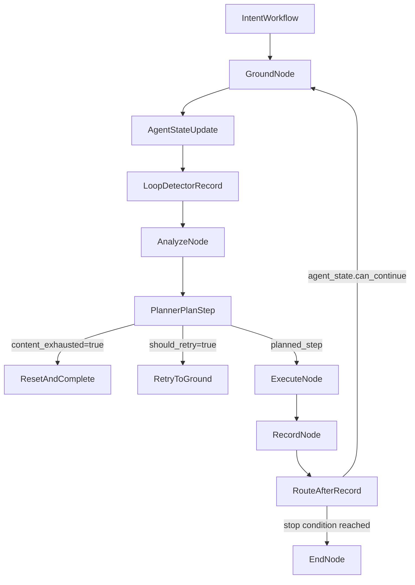

# Loop Detection Integration Guide (Fathom)

This guide explains how Fathom's current loop detection works and how to wire the same behavior into another agent implementation with parity.

## Current Implementation Status (No-XML Hybrid Delta)

The intent workflow now includes a no-XML screen-change delta path with optional Gemini hybrid hints:

- Runtime computes post-action `ScreenDeltaSignal` in intent `record` node.
- `AgentState` tracks low-delta streak and uses it as an additional stuck signal.
- Planner forwards delta context into `VisionTool.analyze(...)`.
- `execute_ui` schema supports optional Gemini delta fields (`delta_observed`, anchors, summaries, confidence).
- Parser maps those fields into `AnalysisResult.gemini_delta`.

## Scope and Boundaries

- This guide covers **intent execution loop detection** (the goal-directed workflow), not general graph cycle analysis.
- Fathom has two different anti-loop systems:
  - **Intent workflow:** `LoopDetector` + planner + routing guards.
  - **Exploration workflow:** DFS/BFS phase logic with `content_exhausted` and backtracking, while classic loop detector is effectively disabled.
- Graph cycle analysis in knowledge graph utilities is separate from runtime "agent stuck" detection.

## Source-of-Truth Files

- Core detector and screen equivalence:
  - [`src/fathom/schemas/state.py`](src/fathom/schemas/state.py)
  - [`src/fathom/schemas/screens.py`](src/fathom/schemas/screens.py)
  - [`src/fathom/schemas/delta.py`](src/fathom/schemas/delta.py)
- Runtime wiring:
  - [`src/fathom/agent/state.py`](src/fathom/agent/state.py)
  - [`src/fathom/agent/planner.py`](src/fathom/agent/planner.py)
  - [`src/fathom/graph/nodes.py`](src/fathom/graph/nodes.py)
  - [`src/fathom/graph/state.py`](src/fathom/graph/state.py)
- Tool and parser handshake for exhaustion signal:
  - [`src/fathom/tools/definitions.py`](src/fathom/tools/definitions.py)
  - [`src/fathom/schemas/tool_requests.py`](src/fathom/schemas/tool_requests.py)
  - [`src/fathom/services/parsing.py`](src/fathom/services/parsing.py)
  - [`src/fathom/tools/vision/base.py`](src/fathom/tools/vision/base.py)
  - [`src/fathom/tools/vision/gemini.py`](src/fathom/tools/vision/gemini.py)
- Outcome propagation:
  - [`src/fathom/workflows/intent.py`](src/fathom/workflows/intent.py)
  - [`src/fathom/cli.py`](src/fathom/cli.py)
- Behavioral tests:
  - [`tests/unit/test_loop_detector.py`](tests/unit/test_loop_detector.py)
  - [`tests/unit/test_parsing_exhaustion.py`](tests/unit/test_parsing_exhaustion.py)
  - [`tests/unit/test_langgraph_integration.py`](tests/unit/test_langgraph_integration.py)
  - [`tests/unit/test_planner_loop_contract.py`](tests/unit/test_planner_loop_contract.py)

## Runtime Flow (Where Loop Decisions Happen)

Primary hooks:
- `ground` node computes `ScreenState` and calls `AgentState.update_screen(...)`.
- `AgentState.update_screen(...)` records current screen/action into `LoopDetector` (with non-physical action filtering).
- `analyze` node invokes planner, passing `is_stuck` hint and context.
- `StepPlanner.plan_step(...)` handles `is_stuck`, `can_continue`, and `content_exhausted`.
- `record` and route functions enforce termination when `can_continue` becomes false.
- `record` node now recomputes post-action state and persists no-XML delta metadata into `StepResult`.

## Loop Detection Algorithm (Current)

## 1) Inputs and rolling state

`LoopDetector` stores:
- recent screens (deque)
- recent action descriptions (deque)
- recovery attempts count
- recovery limit

`AgentState` additionally tracks:
- `last_delta_score`
- `low_delta_streak`

Configured fields:
- `threshold` (default 3): repetitions required to classify as stuck.
- `window_size` exists as a model field.

Important parity note:
- In current implementation, internal deques are hardcoded `maxlen=5`, so `window_size` is not driving deque size at runtime.

## 2) Screen equivalence (`ScreenState.is_same_screen`)

Two screens are treated as the same only if:
- `activity_hash` matches, and
- `xml_hash` does not indicate structural difference (when both are present and non-zero), and
- `interaction_hash` does not indicate interactive-element difference (when both are present and non-zero), and
- visual hash hamming distance is within threshold (default 10).

This is a multi-signal identity check, not pure visual matching.

## 3) Stuck classification

`LoopDetector.is_stuck()` returns true if either condition hits threshold:
- repeated same-equivalent screen in the recent window, or
- repeated same action description in the recent window.

False-positive suppression:
- If repeated screens are detected but recent actions are sufficiently diverse (`>= threshold` unique actions across `>= threshold` recent actions), detector bypasses stuck for that candidate.

Additional no-XML stuck signal:
- If `low_delta_streak >= 3`, `AgentState.is_stuck` returns true even when classic repeat detection does not trigger.

## 4) Recovery budget and stop gate

- `LoopDetector.can_recover()` checks whether recovery attempts are below cap (private cap is 3).
- `AgentState.can_continue` returns false when:
  - complete flag is set, or
  - step count reached max, or
  - stuck is true and recovery is exhausted.

## 5) Reset conditions

Loop state resets in these cases:
- New screen detected in `AgentState.update_screen(...)`.
- Activity changed relative to previous screen (treated as progress).
- Model signals `content_exhausted=true`, via `AgentState.reset_loop_detector()`.

## Required Contracts to Preserve

To port reliably, preserve these behavioral contracts exactly.

## A) Tool schema -> parser -> analysis result

1. Tool contract includes `content_exhausted` on `execute_ui`.
2. Request model supports it.
3. Parser maps it into `AnalysisResult.content_exhausted`.
4. Optional hybrid fields are accepted and parsed into `AnalysisResult.gemini_delta`:
   - `previous_screen_summary`, `current_screen_summary`
   - `delta_observed`, `delta_reasoning`, `delta_confidence`
   - `visible_anchors`, `top_anchor`, `bottom_anchor`

If any layer drops this flag, repeated-scroll loops will not terminate correctly.

## B) Planner handling of stuck and exhaustion

In `plan_step(...)` equivalent:
- If `not can_continue`, terminate with clear reason.
- If `analysis.content_exhausted`, reset loop detector and mark complete.
- If currently stuck but not complete, record recovery attempt and continue replanning flow.
- Pass `delta_context` (`last_delta_score`, `low_delta_streak`) to vision analyze for strategy shaping.

## C) Graph/state contract

Graph state should preserve at least:
- `is_complete`
- `should_retry`
- `completion_reason`
- `planned_step`
- validation retry counters used by analyze-node guardrails:
  - `validation_followup_attempts`
  - `validation_completion_attempts`
  - `overlay_condition_attempts`

These counters are part of loop prevention for validation-style intent flows.

## D) Execution semantics for non-physical actions

`VALIDATE`, `COMPLETE`, `SAVE_MEMORY`, `RETRIEVE_MEMORY` should behave as successful no-op execution results (no physical device action). This avoids artificial device-loop effects and keeps semantics aligned.

For physical actions:
- Recapture post-action screen state in `record` node.
- Compute no-XML `ScreenDeltaSignal` and persist it in `StepResult.screen_delta`.
- Update `post_hash` and `screen_changed` from this recapture result.

## E) User-visible propagation

`completion_reason` must survive:
- planner/node decisions
- workflow result assembly
- CLI reporting

This is required for operational debugging and parity verification.

## Wiring Checklist (Recommended Implementation Order)

Use this exact order in the target agent version.

1. **State layer**
   - Add/port `LoopDetector`.
   - Add/port `AgentState` fields and methods: `is_stuck`, `can_continue`, `update_screen`, reset/recovery methods.
   - Preserve non-physical action filtering before loop recording.
   - Track low-delta streak and include delta context in planner payload.

2. **Screen identity**
   - Port multi-signal `is_same_screen(...)` behavior.
   - Keep visual distance threshold default parity.

3. **Tool and parser contracts**
   - Add `content_exhausted` to tool schema and request model.
   - Parse into analysis object.
   - Ensure default false when omitted.
   - Add optional Gemini hybrid delta fields and parse into typed signal object.

4. **Planner logic**
   - Inject stuck hint into model call.
   - Implement exhaustion completion path and stuck recovery attempt increment.
   - Keep action-rejection / retry behavior consistent (`should_retry` routing contract).
   - Forward delta context into `vision.analyze(...)`.

5. **Graph node integration**
   - Ground node updates screen and detector state.
   - Analyze node enforces validation anti-loop guards and completion blocking rules.
   - Route-after-record checks `can_continue` to terminate hard loops.
   - Recompute post-action screen state and persist delta metadata in `StepResult`.

6. **Execution layer parity**
   - Keep non-physical action no-op success semantics.
   - Keep type-focus guard (`TYPE` requires bounds/focus tap) to avoid repeated invalid-type loops.

7. **Workflow and CLI outputs**
   - Propagate completion reason end-to-end.
   - Ensure failed termination modes are distinguishable in output.

## Exploration Workflow Difference (Do Not Mix Systems)

In exploration path:
- `AgentState` is created with `loop_threshold=999_999` to disable classic stuck detection.
- Loop prevention is instead done by exploration state machine (`phase`, `fully_scanned`, path/backtrack/orphan handling) plus `content_exhausted`.

Do not copy exploration anti-loop logic into intent workflow as a direct replacement; they solve different problems.

## Known Pitfalls and Parity Risks

1. **`window_size` mismatch risk**
   - Current detector field exists but internal deque maxlen is fixed (5). If you make it dynamic in the target implementation, behavior may drift.

2. **Checkpoint fidelity gap**
   - Current checkpoint only persists recovery attempts from loop detector, not full recent screen/action buffers.
   - Resume behavior may be less loop-aware than uninterrupted execution.

3. **Unused explicit recovery action API**
   - `AgentState.get_recovery_action()` exists, but planner path currently increments attempts and relies on model replanning rather than directly executing that action sequence.

4. **Validation-loop guard dependence**
   - Some anti-loop outcomes depend on analyze-node counters, not only `LoopDetector`.
   - Missing these counters can reintroduce repeated validation loops.

5. **Prompt adherence dependence**
   - `content_exhausted` reliability depends on model following prompt rules in scroll/end-of-list situations.

## Parity Test Matrix (What to Run/Add)

Minimum parity suite:

1. **Detector behavior**
   - Repeated same screen reaches stuck threshold.
   - `signal_content_exhausted()` clears stuck state and history behavior.
   - Repeated same action reaches stuck threshold.
   - Diverse-action bypass prevents false stuck in repeated-screen scenarios.

2. **Parser contract**
   - `execute_ui` with `content_exhausted=True` maps correctly.
   - Missing flag defaults to false.
   - Validation event typing remains correct for `validate_state`, `verify_goal`, and `execute_ui(action_type=validate)`.
- Hybrid delta fields map into `AnalysisResult.gemini_delta`.

3. **Planner contract**
   - `content_exhausted` marks complete and resets detector.
   - Stuck + recoverable increments recovery attempts.
   - `not can_continue` terminates with deterministic reason.
- `delta_context` is passed into vision analyze call.

4. **Graph routing guards**
   - `should_retry` routes back to grounding.
   - Missing/duplicate validation behavior triggers retry/block reasons instead of infinite loops.
   - After record, `can_continue=False` terminates.
- No-XML delta helper marks changed/unchanged correctly for activity/visual transitions.

5. **End-to-end reason propagation**
   - Completion reason from loop/exhaustion paths appears in workflow result and CLI output.

Suggested extra tests to close current gaps:
- checkpoint resume with pre-loop context retained (if you choose to persist full detector buffers),
- oscillation patterns across two screens with activity changes,
- validation-loop counter saturation behavior.

## Agent Handoff Execution Script (for your colleague's parallel agent)

Use this as the implementation playbook:

1. Port detector + state contracts.
2. Port parser/tool exhaustion handshake.
3. Port planner termination/recovery logic.
4. Port graph-level validation loop guards and retry counters.
5. Run parity tests listed above and compare terminal reasons/messages.
6. Validate one real scenario with repeated scroll to ensure `content_exhausted` exits cleanly.

If all six steps pass, loop-detection wiring is functionally aligned with current Fathom behavior.
