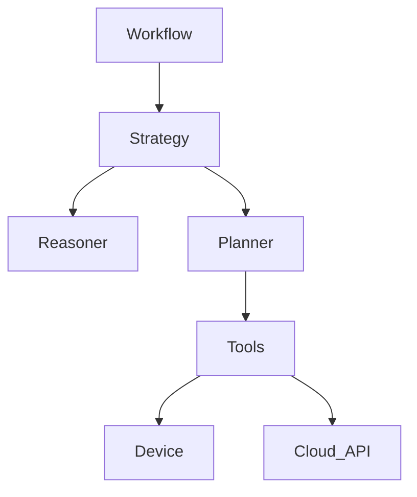

# Fathom

**Fathom** is a robust agentic framework for mobile automation, designed to reliably execute complex workflows using visual understanding and intelligent planning.

It bridges the gap between high-level intent ("login to the app") and low-level execution (adb taps/swipes), handling retry logic, error recovery, and loop detection automatically.

## Features

- **Intelligent Agent**: Uses LLMs (Gemini, etc.) to understand screen content and plan actions.
- **Robust Workflow Engine**: Built-in state management, check-pointing, and retry logic.
- **Real Device Support**: First-class support for ADB and Appium, controlling real phones and emulators.
- **Auto-Recovery**: Detects loops (stuck on same screen) and automatically attempts recovery (Back -> Home).
- **Hybrid State Hashing**: Efficiently tracks visited states using perceptual, structural, and content hashing.

## Installation

```bash
pip install git+https://github.com/DrizzDev/fathom.git
```

Or for development:

```bash
git clone https://github.com/DrizzDev/fathom.git
cd fathom
pip install -e "."
```

## Quick Start

### 1. Configuration

Set up your tools (ADB and Vision):

```python
from fathom.tools.device import ADBDeviceTool, ADBConfig
from fathom.tools.vision import GeminiVisionTool, GeminiConfig
from fathom.tools.capture import ADBCaptureTool

# Initialize tools
device = ADBDeviceTool(ADBConfig(device_serial="emulator-5554"))
capture = ADBCaptureTool()
vision = GeminiVisionTool(GeminiConfig(api_key="YOUR_API_KEY"))
```

### 2. Run an Intent Workflow

Execute a specific goal:

```python
import asyncio
from fathom.workflows import IntentWorkflow, WorkflowConfig

async def main():
    workflow = IntentWorkflow(
        workflow_id="login-flow-001",
        device=device,
        capture=capture,
        vision=vision,
        intent="Login with username 'user' and password 'pass'",
        config=WorkflowConfig(
            max_steps=50,
            step_timeout=10.0
        )
    )

    result = await workflow.execute()

    if result.status == "success":
        print("Login successful!")
    else:
        print(f"Failed: {result.error}")

if __name__ == "__main__":
    asyncio.run(main())
```

### 3. Run an Exploration Workflow

Discover available screens and actions:

```python
from fathom.workflows import ExplorationWorkflow

async def explore():
    explorer = ExplorationWorkflow(
        device=device,
        vision=vision,
        capture=capture,
        workflow_id="explore-001",
        config=WorkflowConfig(max_steps=100)
    )

    result = await explorer.execute()
    print(f"Discovered {result.unique_screens} unique screens")
    print(f"Coverage: {result.coverage_percentage:.1f}%")

if __name__ == "__main__":
    asyncio.run(explore())
```

## Architecture

Fathom is built in layers:

1.  **Workflows**: High-level orchestration (Intent, Exploration). Manages lifecycle and results.
2.  **Agent Strategy**: The "brain" logic (Loop detection, Recovery, Planning, Reasoning).
3.  **Tools**: Interfaces for outside world (Device, Vision, Capture).
4.  **Orchestration**: Execution engine (Step tracking, retries, history).



## Development

Install dev dependencies and pre-commit hooks:

```bash
pip install -r requirements.txt
pre-commit install
```

Run checks:

```bash
ruff check .
mypy src
```
