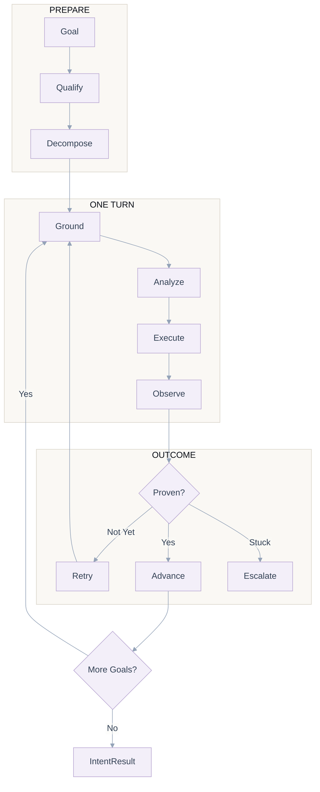
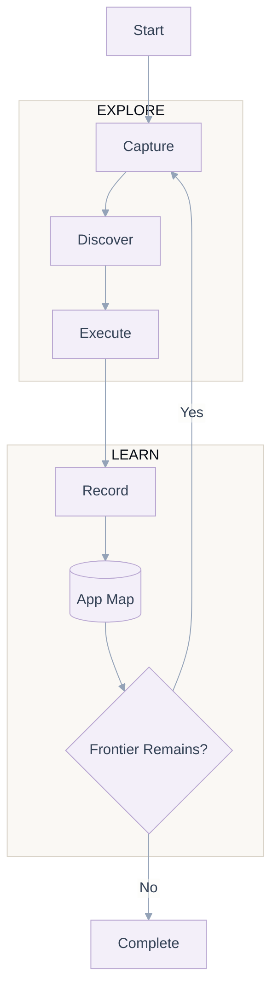
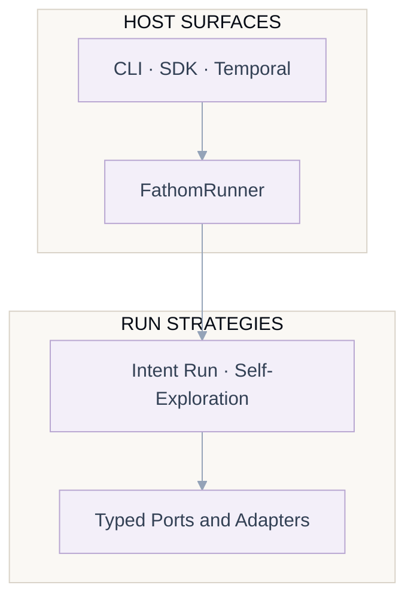
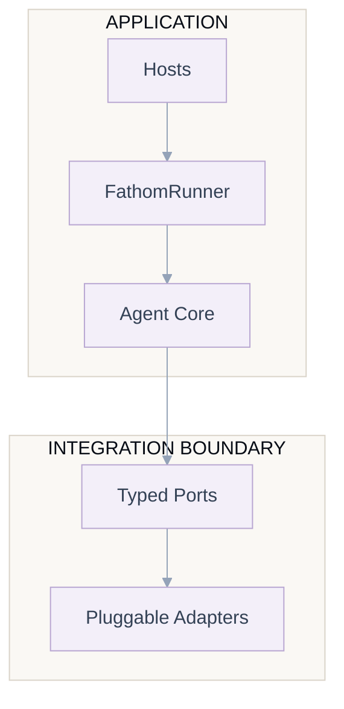
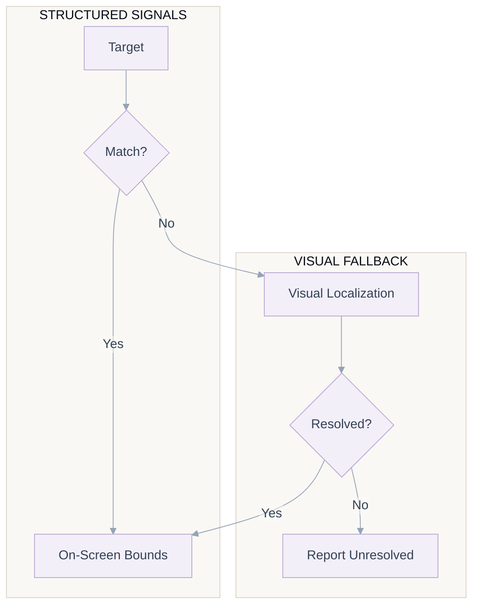
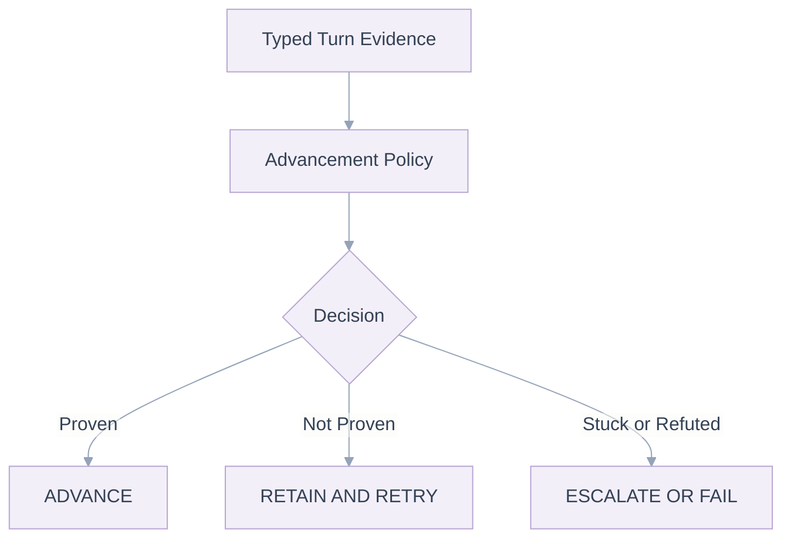

# Fathom

**Fathom is an execution harness for mobile agents.** Hand it a plain-language goal — *"log in and
open the orders page"* — and it drives a real device, **iOS or Android**, to completion: reading each
screen, deciding the next action, dispatching it, verifying the action actually happened, and
recovering when it stalls.

It owns the hard parts between a high-level goal and low-level taps — decomposing intent into
sub-goals, grounding to the right on-screen element, breaking out of loops, and asking a human when
genuinely stuck — so whatever sits on top (an agent, a test author, a generated script) works in
*intent*, not taps.

The same core runs two ways — a goal-directed **intent run** or an autonomous **self-exploration**
crawl — and you drive it from an in-process **SDK**, a **CLI**, or a durable **Temporal** worker.
Device, model, and storage sit behind typed ports, so switching Android to iOS, Gemini to Vertex, or
local to cloud is a configuration change, not a rewrite.

## Highlights

- **Two strategies, one core.** Drive toward a specific goal with an **intent run**, or map an app
  automatically with **self-exploration** — both are LangGraph state machines over the same ports.
- **Host-agnostic.** Run the same agent from an **SDK builder**, a **CLI**, or a **Temporal** worker
  for durable, resumable execution with out-of-process human-in-the-loop control.
- **Plug-and-play.** Every capability — device, model, perception, memory, knowledge, storage,
  telemetry, conversation, signals — is a typed **port** with swappable **adapters**. Wire the ones
  you need with a fluent builder; replace any of them without touching the core.
- **Configurable end to end.** A single typed `FathomConfiguration` turns subsystems on and off and
  tunes them: which perception signals run, ensemble membership, elevated-capacity inference, storage
  backends, checkpointing, per-device settings, and the qualifier — all with safe defaults.
- **Cross-platform.** iOS (over WebDriverAgent) and Android (over ADB) sit behind the same device and
  perception ports; you swap the adapter, not your code.
- **Evidence-based.** A sub-goal advances only when the screen, a matched action, or a committed
  capture proves it — never because the model claimed success.
- **Observable.** Every run is recorded as a structured conversation (threads, messages, tasks,
  artifacts, generated scripts) behind an interaction port, alongside structured telemetry.

## Two ways to drive a device

Fathom ships two strategies. Both share the same grounding, execution, and recording primitives and the
same LangGraph infrastructure; they differ in what they are trying to achieve.

### Intent runs — goal-directed

Given a plain-language goal and an app, Fathom qualifies the intent, decomposes it into ordered
sub-goals, and works toward them one turn at a time. Each turn perceives the screen, makes one
vision-language-model decision, localizes and dispatches the action, and then proves the sub-goal from
evidence before advancing. One pass through the loop:



Before the loop begins, a **qualifier** decides whether the intent is an executable UI task, and a
**decomposer** breaks it into ordered sub-goals. Each turn then runs **Ground** (capture + perceive),
**Analyze** (one vision-language-model call), **Supervise** (localize the target), **Execute**
(dispatch the gesture), **Observe** (did the screen change?), **Record** (persist the step), and
**Verify** (adjudicate the sub-goal from evidence, then advance, retry, or escalate).

### Self-exploration — autonomous app-mapping

With no goal to chase, Fathom can explore an app on its own: it repeatedly grounds the current screen,
asks the model for one *unique interactive element* to try, executes it, and records the screen and the
transition into an **app-map** (screens keyed by a visual fingerprint, plus the actions tried on each).
It tracks a frontier of screens that still have unexplored elements and keeps going until it runs out
of steps or time, or the frontier is empty. Exploration is **visual-only** — it does not use the
accessibility hierarchy — and produces a coverage map rather than a pass/fail result.



> Self-exploration is an earlier-stage capability than intent runs. Frontier tracking and the app-map
> are in place; richer path-replay navigation between screens is still being built out.

## Running Fathom

The same runner core — `FathomRunner`, with `run_intent` and `run_exploration` — sits behind three host
surfaces. You pick a strategy by choosing a run method (SDK), a subcommand (CLI), or a workflow
(Temporal); all three support both strategies.



- **SDK (in-process).** `Fathom.builder()` returns a fluent builder; wire the ports you need and call
  `build()` to get a `FathomRunner`, then `await runner.run_intent(...)` or `run_exploration(...)`. Best
  when Fathom is embedded inside a larger Python service.
- **CLI.** The installed `fathom` command exposes `fathom run "<goal>"` for an intent run and
  `fathom explore` for autonomous mapping, with flags for platform, device, model key, and step budget.
  Best for quick local runs and scripting.
- **Temporal (durable).** Optional `fathom[temporal]` extra. `FathomWorkflow` and
  `FathomExplorationWorkflow` run on a worker; the real work happens in retryable, heartbeated
  activities, and Temporal **signals** (`pause`, `resume`, `inject`, `cancel`) let a human steer or
  interrupt a live run from **outside the process** — surviving restarts. Best for production fleets and
  long-running, resumable jobs with human-in-the-loop control.

## Architecture

Fathom is a **hexagonal (ports-and-adapters)** application, and the layering is mandatory. The core
agent logic is pure and depends only on typed ports; the outside world — hosts, devices, models,
storage — plugs in as adapters. That is what keeps the core testable, vendor-neutral, cross-platform,
and host-agnostic.



## Inside the pipeline

These stages power an intent run. Each concern is its own layer behind a port, so it can be tuned,
replaced, or turned off independently.

- **Qualification.** An intent qualifier decides whether a request is an executable UI task before any
  device work happens, so gibberish and conversational prompts never reach the device. It runs on its
  own model configuration and can be disabled entirely.
- **Decomposition.** The decomposer turns one intent into an ordered list of typed sub-goals — observed
  outcomes, command postconditions, or captures — each carrying the evidence that will later prove it.
- **Perception and the ensemble.** Perception reads the screen through layered signals — the platform
  view hierarchy plus optional OCR, icon-template, and computer-vision detectors. Ensemble services
  merge multiple detectors and localizers and let them vote, so grounding degrades gracefully instead
  of failing when any one signal is weak. Every signal is opt-in through configuration.
- **Grounding.** Locating a target falls back through progressively richer signals rather than tapping
  blind, so it works whether or not a clean hierarchy is available.



- **Planning.** The intent graph is a **LangGraph** state machine with typed channels and a checkpoint
  store, so a run can pause, resume, and survive a process restart. Nodes are thin handlers; the heavy
  decision logic lives in the pure core.
- **Verification and completion.** Completion is evidence-driven: each turn produces typed evidence,
  and an advancement policy decides the outcome — never the model's word alone.



- **Human-in-the-loop.** When the agent is genuinely stuck, or when a step needs a human, an HITL
  service asks a question and waits on the signal port. It pauses and resumes the run cleanly, records
  the exchange, and injects the answer as guidance. Under the Temporal host this becomes durable and
  out-of-process — a human can pause, inject context, or cancel a live run from anywhere.
- **Conversation and observability.** Every run is recorded through an interaction port as a structured
  conversation — threads, messages, tasks, linked artifacts, and generated scripts — so a run is fully
  re-constructable after the fact. Ships with a Postgres adapter and a no-op adapter for local use.

## Plug-and-play

Nothing in the core is bound to a vendor. Each concern is a typed port with one or more adapters, and
you assemble a runner by wiring only the ports you need. Four ports are required — **device, model,
perception, conversation** — and the rest default to sensible local implementations.

- **Device:** ADB for Android, WebDriverAgent for iOS, and remote-device adapters; replace them through
  `DevicePort`.
- **Model:** Gemini through a direct API key or Vertex AI; replace it through `LLMPort`.
- **Perception:** Android, iOS, and remote perception with optional OCR, icon, and CV ensembles;
  replace them through `PerceptionPort`.
- **Conversation:** Postgres and no-op adapters; replace them through `InteractionPort`.
- **Memory and knowledge:** SQLite by default; replace them through `MemoryPort` and `KnowledgePort`.
- **Storage:** local, GCS, and composite adapters; replace them through `StoragePort`.
- **Signals:** no-op, interactive, socket, and Temporal adapters; replace them through `SignalPort`.
- **Telemetry and summarization:** structured logging, Redis, and LLM summarization adapters behind
  their corresponding ports.

The same Gemini adapter serves both hosted options: pass an **API key** for direct Gemini, or provide
**Vertex AI** project and credentials instead, and it routes accordingly — no code change.

## Configuration

Everything is configured through one typed `FathomConfiguration` with safe defaults, plus environment
variables for credentials. You choose which perception signals run (OCR, CV, icon, overlay), the
ensemble members, whether elevated-capacity inference is enabled, the storage backends, per-device
settings for Android and iOS, checkpointing, and whether the intent qualifier runs — without editing
core code. A copy-ready `.env.template` documents the full set; the most common variables:

| Variable | Purpose |
| --- | --- |
| `GEMINI_API_KEY` | API key for the Gemini model adapter |
| `GEMINI_MODEL` | Model id to use — set this to a model your key can access |
| `VERTEX_PROJECT_ID` / `VERTEX_LOCATION` | Use Vertex AI instead of a direct API key |
| `GOOGLE_APPLICATION_CREDENTIALS` | Path to a service-account JSON for Vertex |

## Requirements

- **Python 3.11+**
- A **vision-language model** — a **Gemini API key**, or Vertex AI credentials
- **A real device, emulator, or simulator** — Android over **ADB** (`adb devices` should list it), or
  iOS over a **WebDriverAgent** gateway
- **Optional:** a running **Temporal** cluster, only if you use the durable host

## Install

```bash
pip install git+https://github.com/DrizzDev/fathom.git
```

With the optional durable host:

```bash
pip install "fathom[temporal] @ git+https://github.com/DrizzDev/fathom.git"
```

From source (for development):

```bash
git clone https://github.com/DrizzDev/fathom.git
cd fathom
pip install -e .
```

## Quickstart

Set your model key and pick a device serial (`adb devices` prints it):

```bash
export GEMINI_API_KEY="..."      # your Gemini API key
```

### CLI — the fastest way

```bash
# Goal-directed intent run
fathom run "Open the orders page and confirm the latest order is delivered" \
  --platform android --serial emulator-5554 --max-steps 40

# Autonomous self-exploration (experimental)
fathom explore --platform android --serial emulator-5554 --max-steps 60
```

Run `fathom --help`, `fathom run --help`, or `fathom explore --help` for every flag (iOS options,
Vertex, interactive human-in-the-loop, verbosity, and more).

### SDK — embed it in Python

Wire an adapter for each required port with the fluent builder, then run an intent:

```python
import asyncio
import os

from fathom.runtime.builder import Fathom
from fathom.adapters.device.local.adb import ADBDevice
from fathom.adapters.llm.gemini import GeminiLLM
from fathom.adapters.perception.android import AndroidPerceptionAdapter
from fathom.adapters.interaction.noop import NoopInteraction
from fathom.schemas.run import Principal


async def main() -> None:
    device = ADBDevice(serial="emulator-5554")
    llm = GeminiLLM(api_key=os.environ["GEMINI_API_KEY"])

    interaction = NoopInteraction()
    perception = AndroidPerceptionAdapter(device=device, include_hierarchy=True)

    runner = (
        Fathom.builder()
        .with_llm(port=llm)
        .with_device(port=device)
        .with_perception(port=perception)
        .with_interaction(port=interaction)
        .build()
    )

    result = await runner.run_intent(
        max_steps=40,
        request_id="run-001",
        package_name="com.example.app",
        intent="Open the orders page and confirm the latest order is delivered",
        principal=Principal(tenant="demo", operator="you", agent="fathom", conversation="thread-001"),
    )
    print(result)
    await runner.cleanup()


if __name__ == "__main__":
    asyncio.run(main())
```

To map an app instead of chasing a goal, call `runner.run_exploration(...)` with the same `request_id`
and `principal`. For **iOS**, swap the two platform adapters — `IOSDevice` and
`IOSNativePerceptionAdapter` — and leave the rest unchanged; they satisfy the same ports.

### Temporal — durable and resumable

Register `FathomWorkflow` / `FathomExplorationWorkflow` and the `FathomActivities` on a worker, then
start a workflow from your client. The activity does the work and heartbeats progress; the workflow
carries durable state and accepts `pause` / `resume` / `inject` / `cancel` signals so a human can steer
a live run across process restarts. See the `fathom.runtime.temporal` package for the worker wiring.

## Privacy & data

To plan actions, Fathom captures screenshots and the on-screen view hierarchy of the app under
automation. By default these artifacts stay on the local machine; cloud upload is off unless you
explicitly enable a cloud storage backend and provide a bucket. Only run Fathom against apps and data
you are authorized to automate.

## Contributing

Contributions are welcome — see [`CONTRIBUTING.md`](CONTRIBUTING.md), the engineering standards in
[`AGENTS.md`](AGENTS.md), and our [`CODE_OF_CONDUCT.md`](CODE_OF_CONDUCT.md). To report a security issue
privately, see [`SECURITY.md`](SECURITY.md).

## Development

```bash
pip install -e .
pip install -r requirements.txt
pre-commit install
```

Run the same checks CI runs:

```bash
pre-commit run --all-files   # ruff, formatting, mypy, and repository checks
pytest                       # tests
```

## License

Fathom is released under the **Business Source License 1.1** — see [`LICENSE`](LICENSE). Under BSL, the
source is available now and converts to a fully open-source license on the date stated in the license
file.
